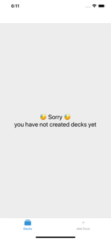
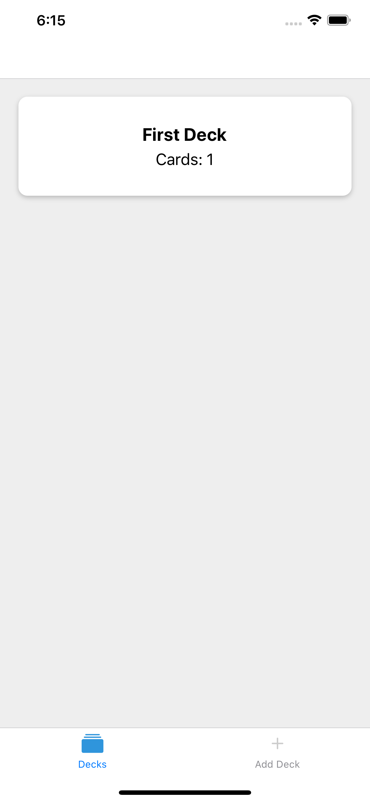

# Mobile Flashcards App - Udacity's React Nanodegree 3rd project

## Prroject Overview

Building a mobile application (Android or iOS - or both) that allows users to study collections of flashcards. The app will allow users to create different categories of flashcards called "decks", add flashcards to those decks, then take quizzes on those decks.

This is my submission that follows Udacity's specifications and built using **React Native**.

### Screenshots & Example scenario






## Installation

Copy clone this repo

```
git clone https://github.com/7mdb/mobile-flashcards-reactnd.git
```

CD to the repo local directory

```
cd mobile-flashcards-reactnd
```

Install required packages

```
yarn install OR npm install
```

Run the app

```
yarn start OR npm start
```

### Platform

This project has been tested on both (iOS & Android emulators).
